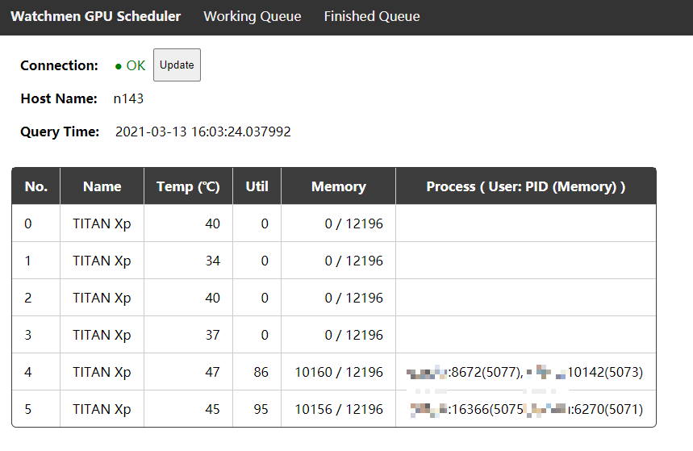
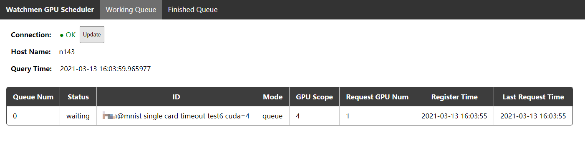
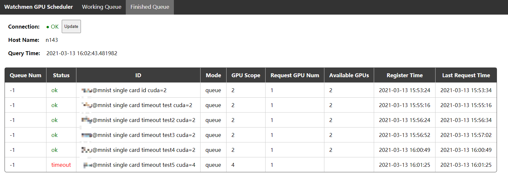

# Watchmen
A simple and easy-to-use toolkit for GPU scheduling.

## Dependencies
- [Python](https://www.python.org/downloads/) >= 3.6
  - requests >= 2.24.0
  - pydantic >= 1.7.1
  - gpustat >= 0.6.0
  - flask >= 1.1.2
  - apscheduler >= 3.6.3

## Installation

1. Install dependencies. 
```bash
$ pip install -r requirements.txt
```

2. Install watchmen.

Install from source code:
```bash
$ pip install -e .
```

Or you can install the stable version package from pypi.
```bash
$ pip install gpu-watchmen -i https://pypi.org/simple
```

## Quick Start
1. Start the server

The default port of the server is `62333`
```bash
$ python -m watchmen.server
```

If you want the server to be running backend, try:
```bash
$ nohup python -m watchmen.server 1>watchmen.log 2>&1 &
```

There are some configurations for the server
```
usage: server.py [-h] [--host HOST] [--port PORT]
                 [--queue_timeout QUEUE_TIMEOUT]
                 [--request_interval REQUEST_INTERVAL]
                 [--status_queue_keep_time STATUS_QUEUE_KEEP_TIME]

optional arguments:
  -h, --help            show this help message and exit
  --host HOST           host address for api server
  --port PORT           port for api server
  --queue_timeout QUEUE_TIMEOUT
                        timeout for queue waiting (seconds)
  --request_interval REQUEST_INTERVAL
                        interval for gpu status requesting (seconds)
  --status_queue_keep_time STATUS_QUEUE_KEEP_TIME
                        hours for keeping the client status. set `-1` to keep
                        all clients' status
```

2. Modify the source code in your project:

```python
from watchmen import WatchClient

client = WatchClient(id="short description of this running", gpus=[1],
                     server_host="127.0.0.1", server_port=62333)
client.wait()
```

When the program goes on after `client.wait()`, you are in the working queue.
Watchmen supports two requesting mode:
- `queue` mode means you are waiting for the gpus in `gpus` arguments.
- `schedule` mode means you are waiting for the server to spare `req_gpu_num` of available GPUs in `gpus`.
You can check examples in `example/` for further reading.

```bash
# single card queue mode
$ cd example && python single_card_mnist.py --id="single" --cuda=0 --wait
# single card schedule mode
$ cd example && python single_card_mnist.py --id="single schedule" --cuda=0,2,3 --req_gpu_num=1 --wait_mode="schedule" --wait
# queue mode
$ cd example && python multi_card_mnist.py --id="multi" --cuda=2,3 --wait
# schedule mode
$ cd example && python multi_card_mnist.py --id='multi card scheduling wait' --cuda=1,0,3 --req_gpu_num=2 --wait="schedule"
```

3. Check the queue in browser.

Open the following link to your browser: `http://<server ip address>:<server port>`, for example: `http://192.168.126.143:62333`.

And you can get a result like the demo below.
Please be aware that the page is not going to change dynamically, so you can refresh the page manually to check the latest status.

Home page: GPU status



Working queue:


Finished queue:



1. Reminder when program is finished.

`watchmen` also support email and other kinds of reminders for message informing.
For example, you can send yourself an email when the program is finished.

```python
from watchmen.reminder import send_email

... # your code here

send_email(
    host="smtp.163.com", # email host to login, like `smtp.163.com`
    port=25, # email port to login, like `25`
    user="***@163.com", # user email address for login, like `***@163.com`
    password="***", # password or auth code for login
    receiver="***@outlook.com", # receiver email address
    html_message="<h1>Your program is finished!</h1>", # content, html format supported
    subject="Proram Finished Notice" # email subject
)
```

To get more reminders, please check `watchmen/reminder.py`.

## UPDATE
- v0.3.5: fix front-end api port bug
- v0.3.4: refreshed interface, add `register_time` field, fix `check_finished` bug
- v0.3.3: fix `check_finished` bug in server end, quit the main thread if the sub-thread is quit, and remove the backend cmd in the main thread
- v0.3.2: fix `WatchClient` bug
- v0.3.1: change `Client` into `WatchClient`, fix `ClientCollection` and `send_email` bug
- v0.3.0: support gpu scheduling, fix blank input output, fix `check_gpus_existence`
- v0.2.2: fix html package data, add multi-card example

## TODO
- [ ] import user authentication modules to help the working queue delete operations
- [ ] read programs' pids to help reading program working status and kill tasks remotely
- [ ] test and support distributed model parallel configurations (with `python -m torch.distributed.launch`)
- [ ] prettify the web page and divide functions into different tabs
- [ ] gpu using stats for each user and process
- [x] quit the main thread if the sub-thread is quit
- [x] change `Client` into `WatchClient`, in case of any ambiguity
- [x] `ClientCollection/__contains__` function should not include `finished_queue`, to help the `id` releases
- [x] subject bug in `reminder/send_email()`
- [x] add schedule feature, so clients only have to request for a number and range of gpus, and the server will assign the gpu num to clients
- [x] add reminders
- [x] add webui html support
- [x] add examples
